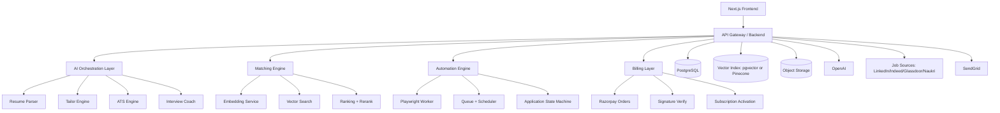

# TalentSync Production Architecture

## 1) Product Positioning
TalentSync is an AI Career Operating System, not only a resume builder.

Core capability stack:
- Resume parsing and structuring
- Semantic job matching
- Resume and cover-letter tailoring
- ATS scoring and optimization
- Auto-apply automation (RPA)
- Application analytics and conversion tracking

## 2) High-Level System Architecture

## 3) Runtime Components

### Frontend
- Next.js App Router
- Dashboard, resume editor, match view, analytics
- Role-based feature gating from subscription state

### Backend API
Recommended production split:
- API/BFF: Next.js route handlers or Node service
- Heavy async workers: FastAPI or Node workers

Responsibilities:
- Auth/session enforcement
- Rate limiting and quota
- Queueing long-running tasks
- Webhook verification

### AI Orchestration Layer
Responsibilities:
- Prompt templates and versioning
- Structured JSON output validation
- Retry + fallback strategy
- Cost and latency telemetry

### Matching Engine
Responsibilities:
- Generate and cache embeddings
- Retrieve candidates by vector similarity
- Optional rerank with additional business signals

### Automation Engine (RPA)
Responsibilities:
- Job search and filtering
- Form filling and resume upload
- Result capture (applied/failed/requires review)
- Human-in-the-loop for anti-bot checkpoints

### Data Layer
- PostgreSQL: transactional data
- pgvector or Pinecone: semantic search
- Blob storage: resume files and generated assets

## 4) AI Model Mapping (Recommended)

| Feature | Model |
|---|---|
| Resume parsing | GPT-4.1 |
| Resume tailoring | GPT-4.1 |
| Cover-letter generation | GPT-4.1 |
| Job description analysis | GPT-4.1 |
| Skill extraction | GPT-4.1 mini |
| Embeddings | text-embedding-3-large |
| Interview AI voice coach | GPT-4o realtime stack |
| Chat assistant | GPT-4.1 mini |

Operational notes:
- Use strict JSON schema checks on all structured outputs.
- Track token usage and latency per endpoint.
- Cache embeddings and deterministic outputs where possible.

## 5) Semantic Matching Algorithm

Core formula:

- resume_embedding = embedding(resume_text)
- job_embedding = embedding(job_description)
- semantic_score = cosine_similarity(resume_embedding, job_embedding)

Recommended production rank score:

final_score =
- 0.55 * semantic_score
- 0.20 * required_skills_overlap
- 0.10 * experience_match
- 0.05 * location_match
- 0.05 * salary_match
- 0.05 * recency_signal

## 6) ATS Engine (Weighted Logic)

ATS score =
- 30% keyword match
- 25% experience relevance
- 15% skills alignment
- 10% education alignment
- 10% formatting quality
- 10% metrics/impact language

Implementation approach:
- Rule-based pre-checks (format and section coverage)
- LLM-based semantic assessment for relevance
- Normalize to 0-100 with explainable breakdown

## 7) Auto-Apply Architecture (RPA)

Execution stack:
- Playwright workers in isolated containers
- Queue-driven job execution (BullMQ/Celery)
- Browser profiles and checkpoint handling

Flow:
1. Fetch target jobs
2. Validate fit threshold
3. Select best resume version
4. Launch automation session
5. Fill forms and upload files
6. Submit or mark as manual review
7. Persist status and logs

Safety:
- Respect site terms and legal boundaries
- Add delays, retries, and failure limits
- Keep users in control with approval mode

## 8) Billing and Subscription Flow (Razorpay)

Flow:
1. Frontend requests plan purchase
2. Backend creates Razorpay order
3. Frontend opens checkout with order_id
4. Razorpay returns payment details
5. Backend verifies signature
6. Persist payment event
7. Activate or renew subscription
8. Issue entitlement update to frontend

Recommended plans:
- Free: INR 0
- Pro: INR 499/month
- Auto Apply: INR 999/month
- Lifetime: INR 2999

## 9) Jobs Ingestion Architecture

Sources:
- LinkedIn
- Indeed
- Glassdoor
- Naukri

Pipeline:
- Scraping workers (Scrapy + Playwright)
- Proxy layer (BrightData equivalent)
- Deduplication and normalization
- Embedding generation
- Upsert into jobs table

Schedule:
- Cron every 6 hours per source

## 10) Landing and Growth Requirements

Landing page sections:
1. Hero with 3D motion
2. Company trust strip
3. How it works
4. ATS demo
5. Match demo
6. Auto-apply demo
7. Pricing
8. Testimonials
9. FAQ
10. Footer

UI stack:
- Tailwind
- shadcn/ui
- Framer Motion
- Recharts
- Optional Spline scene embeds

## 11) Security, Compliance, and Reliability

Must-have controls:
- Row-level security for multi-tenant data isolation
- Signed URL storage access for resume files
- Secret rotation and env segmentation
- PII encryption-at-rest and in-transit
- Request-level audit logs for sensitive operations
- Queue retry policies and dead-letter handling

SLO targets:
- Parse endpoint p95 < 8s
- Match endpoint p95 < 1.5s (cached embeddings)
- Tailor endpoint p95 < 10s
- Worker success rate > 98%

## 12) Immediate Build Phases

Phase 1: Foundation
- Finalize production schema
- Add credits and subscription entitlements
- Add telemetry and feature flags

Phase 2: Matching and ATS
- Hybrid ranker implementation
- ATS score breakdown persistence
- Match explainability in UI

Phase 3: Automation and Billing
- Queue + Playwright auto-apply
- Razorpay order and webhook verification
- Plan gating and credit consumption

Phase 4: Growth
- ATS checker lead magnet page
- Referral flow and ambassador tracking
- SEO content engine for resume and interview terms
